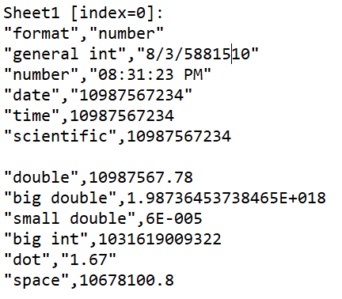

# XLSX2CSV

Создает csv из xlsx файла.

**На входе**: xlsx файл с числами разных типов, форматов

**На выходе**: полученный csv файл


## Тесты для разных форматов чисел в исходном xlsx файле

* строки 2-6 - int с различными форматами ячеек, которые предлагает libre office calc (general, number, date, time, scientific)
C scientific, date, time все в порядке, а number и general, как ни странно, выдают что-то странное
* строки 8-10 - double разных порядков
* строка 11 - int с большим числом знаков - все в порядке
* строка 13 - точка вместо запятой - все в порядке
* строка 14 - добавление пробелов между цифрами (на скрине не видно) - все в порядке

  ====>  

## Тесты для опциальных параметров firstRow, lastRow, sheetRegExp (строки 402-404 класса XLSX2CSV)

* все три null
```
Optional<Integer> firstRow = Optional.ofNullable(null);
Optional<Integer> lastRow = Optional.ofNullable(null);
Optional<String> sheetRegExp = Optional.ofNullable(null);
```
Работает. Обрабатываются все строки и листы в исходном xlsx файле.

* Целые числа, не выходящие из диапазона строк в исходном файле
```
Optional<Integer> firstRow = Optional.ofNullable(3);
Optional<Integer> lastRow = Optional.ofNullable(9);
Optional<String> sheetRegExp = Optional.ofNullable(null);
```
Работает. Обрабатываются строки с 3 по 9 на всех листах исходного xlsx файла.

* Отрицательные числа
  * firstRow
  ```
  Optional<Integer> firstRow = Optional.ofNullable(-9);
  Optional<Integer> lastRow = Optional.ofNullable(null);
  Optional<String> sheetRegExp = Optional.ofNullable(null);
  ```
  Работает. Обрабатываются все строки и листы в исходном xlsx файле.
  * lastRow
  ```
  Optional<Integer> firstRow = Optional.ofNullable(null);
  Optional<Integer> lastRow = Optional.ofNullable(-9);
  Optional<String> sheetRegExp = Optional.ofNullable(null);
  ```
  Тут будет результат теста
